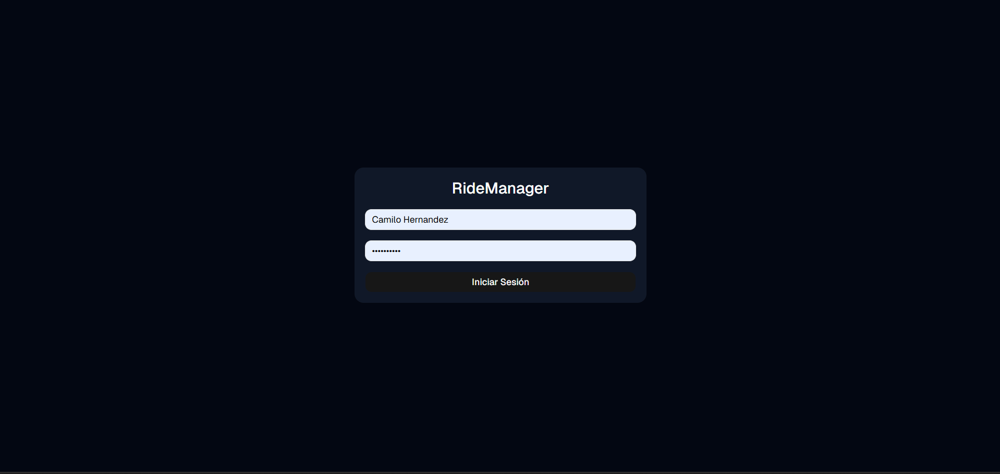
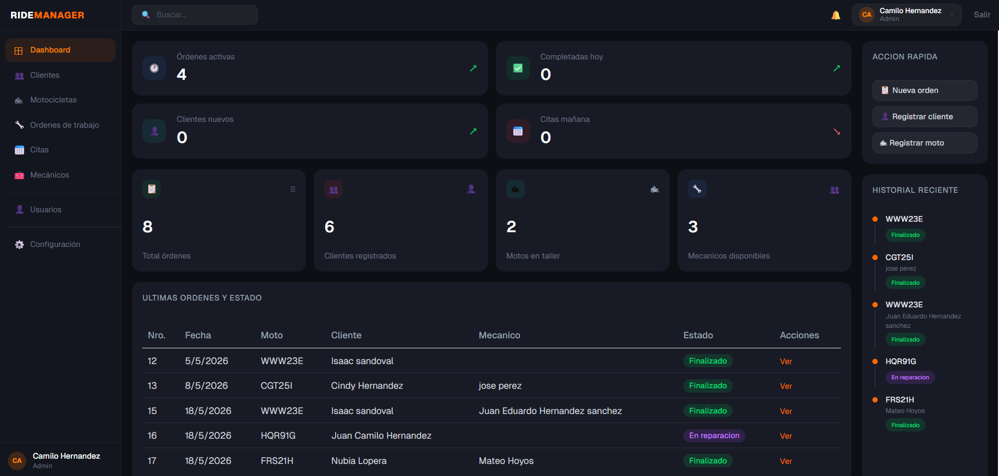
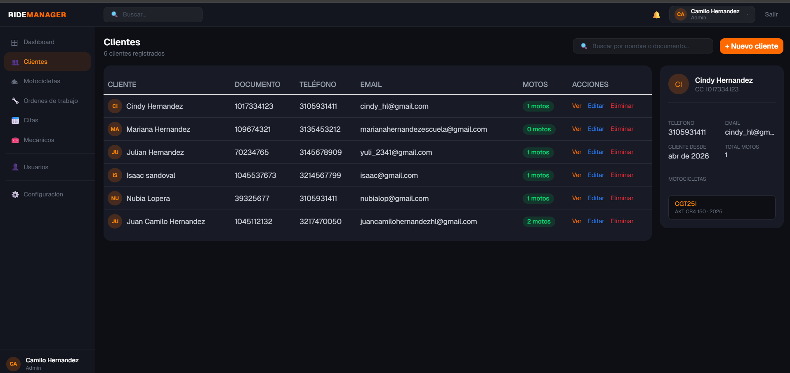
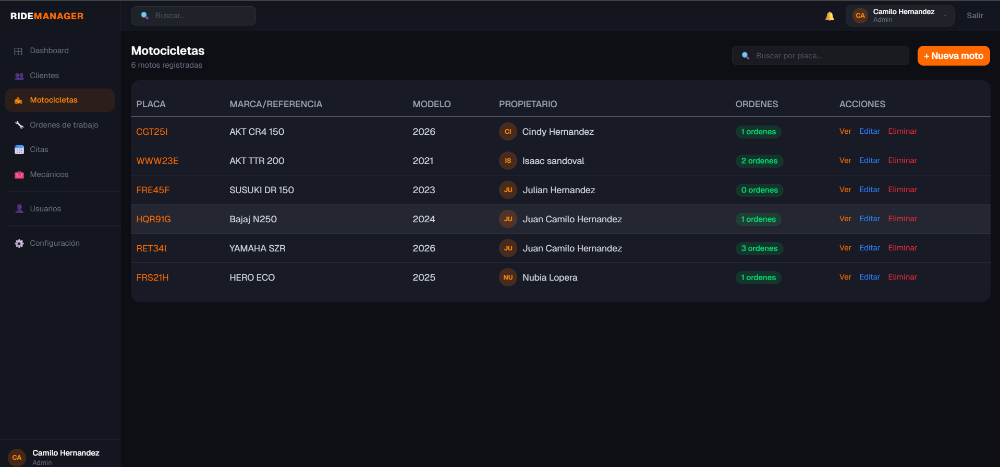
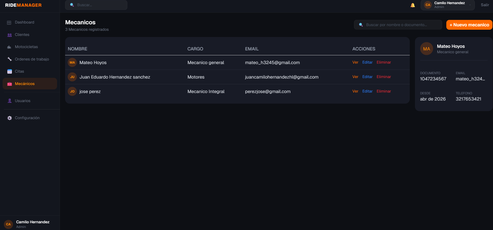
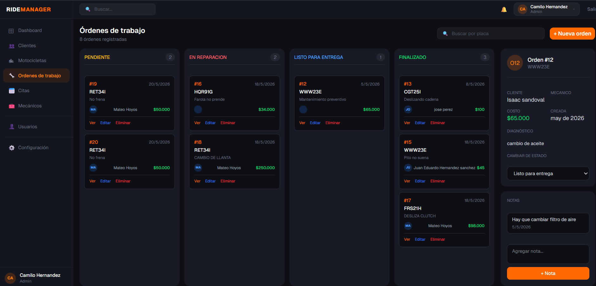
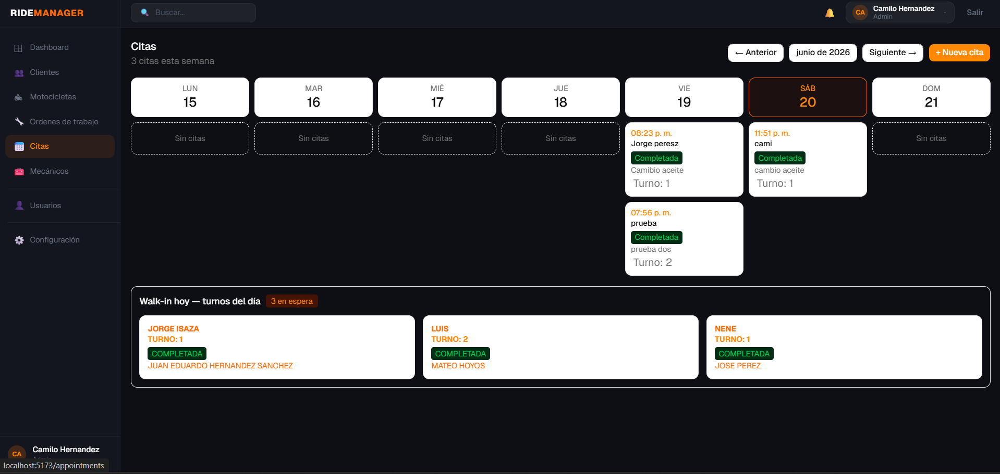
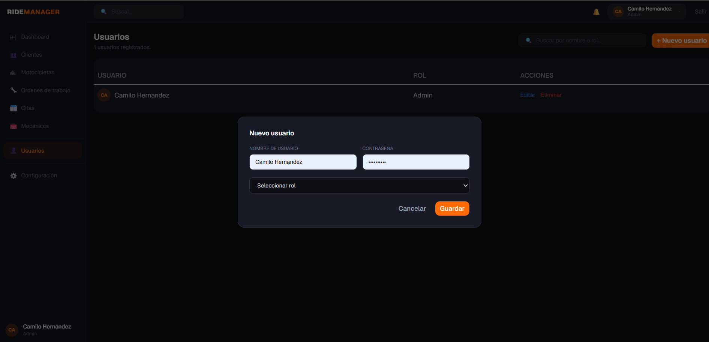

# 🏍️ RideManager

Sistema integral de gestión para talleres mecánicos de motocicletas. Permite administrar propietarios, motos, mecánicos, órdenes de trabajo y citas, con autenticación segura y control de roles.

Proyecto fullstack construido desde cero como parte de mi proceso de aprendizaje en desarrollo de software, aplicando buenas prácticas de arquitectura, seguridad y experiencia de usuario.


---

## 📋 Tabla de contenidos

- [Sobre el proyecto](#-sobre-el-proyecto)
- [Stack tecnológico](#-stack-tecnológico)
- [Funcionalidades](#-funcionalidades)
- [Capturas de pantalla](#-capturas-de-pantalla)
- [Arquitectura](#-arquitectura)
- [Decisiones técnicas](#-decisiones-técnicas)
- [Estructura del proyecto](#-estructura-del-proyecto)
- [Instalación local](#-instalación-local)
- [Roadmap](#-roadmap)
- [Autor](#-autor)

---

## 💡 Sobre el proyecto

**RideManager** resuelve un problema real: la gestión desorganizada de un taller mecánico de motos — citas en cuadernos, órdenes de trabajo en papel, sin trazabilidad del estado de cada moto.

El sistema centraliza toda la operación: desde que el cliente agenda una cita o llega sin previo aviso (walk-in), hasta que su moto sale reparada del taller, pasando por la asignación de mecánicos, seguimiento de órdenes de trabajo y control de usuarios por rol.

---

## 🛠️ Stack tecnológico

### Backend
- **ASP.NET Core Web API** (.NET 8)
- **Entity Framework Core** — ORM y migraciones
- **SQL Server** — base de datos relacional
- **JWT + BCrypt** — autenticación y cifrado de contraseñas
- **FluentValidation** — validación de DTOs

### Frontend
- **React 18** + **TypeScript**
- **Vite** — build tool
- **Tailwind CSS** + **shadcn/ui** — sistema de diseño
- **Zustand** — manejo de estado global
- **Axios** — cliente HTTP con interceptores JWT

---

## ✨ Funcionalidades

### 🔐 Autenticación y roles
- Login con JWT, contraseñas cifradas con BCrypt
- Roles diferenciados: **Admin** y **Mechanic**
- Rutas protegidas según rol

### 📊 Dashboard
- KPIs en tiempo real (órdenes activas, citas del día, etc.)
- Tabla de órdenes de trabajo recientes
- Acceso rápido a acciones frecuentes

### 👥 Gestión de propietarios
- CRUD completo con buscador
- Panel de detalle con historial de motos y órdenes

### 🏍️ Gestión de motocicletas
- CRUD asociado a un propietario
- Historial de órdenes de trabajo por moto
- Navegación directa al detalle de cada orden

### 🔧 Gestión de mecánicos
- CRUD completo con panel de detalle

### 📝 Órdenes de trabajo
- Vista **Kanban** por estado: Pendiente → En reparación → Listo para entrega → Completado
- Cambio de estado mediante `PATCH` (actualización parcial, sin sobrescribir el resto de la orden)
- Sistema de notas por orden
- Eliminación con confirmación

### 📅 Citas (Appointments)
- **Calendario semanal** (lunes a domingo) para citas agendadas
- **Sección de walk-ins** del día con sistema de turnos automático
- Panel de detalle con cambio de estado (Pendiente, Confirmada, Cancelada, Completada)
- Crear, editar y eliminar citas
- Turno visible una vez la cita es completada

### 👤 Gestión de usuarios
- Cambio de username, rol y contraseña desde un panel lateral
- Control de acceso según rol del usuario autenticado

---

## 📸 Capturas de pantalla

> *Agrega aquí una captura de cada página — recomendado 1280x720 o similar*

### Login


### Dashboard


### Propietarios


### Motocicletas


### Mecánicos


### Órdenes de trabajo (Kanban)


### Citas 


### Gestión de usuarios


---

## 🏗️ Arquitectura

El backend sigue una **arquitectura por capas**, separando responsabilidades:

```
┌─────────────────────────────────────┐
│         Controllers (API)            │  ← Recibe peticiones HTTP
├─────────────────────────────────────┤
│      DTOs (Request / Response)       │  ← Contrato con el cliente
├─────────────────────────────────────┤
│         Models (Entidades)           │  ← Reglas de dominio
├─────────────────────────────────────┤
│    Data (DbContext / EF Core)        │  ← Acceso a base de datos
└─────────────────────────────────────┘
```

El frontend sigue una separación clara entre:
- **Pages** — vistas completas
- **Services** — comunicación con la API (Axios)
- **Types** — contratos TypeScript compartidos
- **Components (shadcn/ui)** — UI reutilizable

---

## 🎯 Decisiones técnicas

| Decisión | Por qué |
|---|---|
| **DTOs separados (Request/Response)** | Evita exponer directamente los modelos de base de datos; controla exactamente qué entra y sale de la API |
| **PATCH para cambios de estado** | Editar datos completos y cambiar estado son responsabilidades distintas; PATCH evita sobrescribir información al actualizar solo un campo |
| **JWT + interceptor de Axios** | El token se inyecta automáticamente en cada petición sin repetir lógica en cada servicio |
| **Cascade delete configurado en EF Core** | Mantiene integridad referencial: al eliminar un propietario, sus motos y órdenes se eliminan en cascada; al eliminar un mecánico, sus referencias se ponen en `NULL` (`SetNull`) en vez de romper datos históricos |
| **Zustand sobre Redux** | Menor boilerplate para el tamaño de este proyecto, sin perder manejo de estado global predecible |
| **Validación de enums con `TryParse`** | Evita excepciones no controladas ante valores inválidos provenientes del cliente |

---

## 📁 Estructura del proyecto

```
RideManager/
├── RideManager.Api/
│   ├── Controllers/        # Endpoints REST
│   ├── DTOs/                # Request/Response DTOs
│   ├── Models/               # Entidades y enums
│   ├── Data/                  # DbContext
│   ├── Services/               # Validaciones y lógica auxiliar
│   └── Program.cs               # Configuración (JWT, CORS, EF Core)
└── ridemanager.web/
    └── src/
        ├── pages/            # LoginPage, DashboardPage, OwnersPage, etc.
        ├── services/          # Comunicación con la API (Axios)
        ├── types/              # Interfaces y enums TypeScript
        └── components/ui/       # Componentes shadcn/ui
```

---

## ⚙️ Instalación local

### Backend

```bash
cd RideManager.Api
# Configurar appsettings.json con tu cadena de conexión y clave JWT
dotnet ef database update
dotnet run
```

### Frontend

```bash
cd ridemanager.web
npm install
npm run dev
```

La API corre por defecto en `http://localhost:5000` y el frontend en `http://localhost:5173`.

---

## 🗺️ Roadmap

- [ ] Notificaciones en tiempo real para nuevas citas
- [ ] Reportes exportables (PDF) de órdenes de trabajo
- [ ] Tests unitarios en backend
- [ ] Dashboard con gráficas de ingresos por periodo

---

## 👨‍💻 Autor

**Camilo Hernández**
Desarrollador Full Stack en formación — C# · .NET · React · TypeScript

[LinkedIn](#) · [GitHub](#) · [Correo](#)

---

> Este proyecto fue construido como parte de mi proceso activo de aprendizaje, aplicando conceptos de arquitectura en capas, autenticación segura, manejo de estado y diseño de APIs REST.
